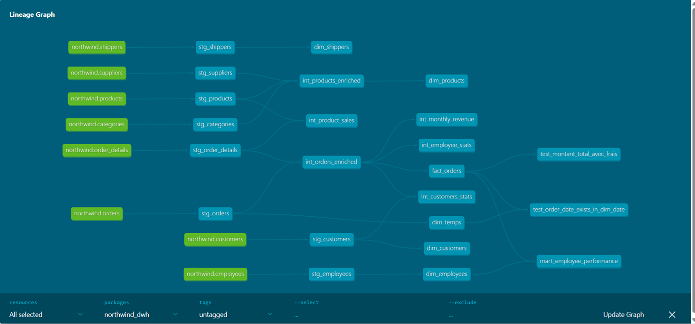

# Northwind Data Warehouse avec dbt

Projet réalisé dans le cadre d'un exercice de Data Engineering visant à construire un Data Warehouse analytique à partir de la base de données **Northwind** à l'aide de **dbt** et **PostgreSQL**.

## Objectifs

L'objectif est de transformer une base OLTP en un Data Warehouse organisé selon une architecture analytique.

Le projet couvre notamment :

- Création des modèles **staging**
- Création des modèles **intermediate**
- Construction d'un modèle en étoile (dimensions + table de faits)
- Création d'un mart analytique
- Mise en place de tests de qualité des données
- Génération de la documentation dbt

---

## Technologies utilisées

- dbt Core
- dbt-postgres
- PostgreSQL
- SQL
- Git / GitHub
- Power BI (visualisation)

---

## Architecture du projet

```
northwind_dwh/
│
├── models/
│   ├── staging/
│   │   ├── schema.yml
│   │   ├── sources.yml
│   │   ├── stg_customers.sql
│   │   ├── stg_orders.sql
│   │   ├── stg_order_details.sql
│   │   ├── stg_products.sql
│   │   ├── stg_categories.sql
│   │   ├── stg_suppliers.sql
│   │   ├── stg_employees.sql
│   │   └── stg_shippers.sql
│   │
│   ├── intermediate/
│   │   ├── int_orders_enriched.sql
│   │   ├── int_products_enriched.sql
│   │   ├── int_customers_stats.sql
│   │   ├── int_employee_stats.sql
│   │   ├── int_monthly_revenue.sql
│   │   └── int_product_sales.sql
│   │
│   └── marts/
│       ├── schema.yml
│       ├── dim_customers.sql
│       ├── dim_products.sql
│       ├── dim_employees.sql
│       ├── dim_shippers.sql
│       ├── dim_date.sql
│       ├── fact_orders.sql
│       └── mart_employee_performance.sql
│
├── tests/
│   ├── test_montant_total_avec_frais.sql
│   └── test_order_date_dim_temps.sql
│
└──dbt_project.yml
```

---

## Structure des modèles

### Staging

Les modèles de staging nettoient et standardisent les données provenant des tables sources.

Principales transformations :

- nettoyage des chaînes de caractères (`TRIM`)
- standardisation de la casse
- typage des colonnes
- renommage des champs
- création de colonnes calculées (`is_shipped`, `sous_total`, `en_stock`, `full_name`, ...)

---

### Intermediate

Les modèles intermédiaires enrichissent les données métier.

Ils permettent notamment de calculer :

- le montant total des commandes
- les délais de livraison
- les statistiques clients
- les statistiques employés
- le chiffre d'affaires mensuel
- les ventes par produit

---

### Marts

Les marts constituent la couche de restitution.

Dimensions :

- dim_customers
- dim_products
- dim_employees
- dim_shippers
- dim_date

Table de faits :

- fact_orders

Mart analytique :

- mart_employee_performance

---

## Tests de qualité

Le projet contient plusieurs types de tests dbt afin de vérifier la fiabilité des données.

### Tests sur les modèles staging

- `not_null` sur les clés primaires
- `unique` sur les clés primaires
- test spécifique pour la clé composée de `stg_order_details`

### Tests sur les marts

- `relationships` entre `fact_orders` et :
  - `dim_customers`
  - `dim_employees`
  - `dim_shippers`
- `accepted_values` sur la colonne `gamme` de `dim_products`
- `not_null` sur `montant_total` et `freight` dans `fact_orders`
- `not_null` sur `is_on_time`, uniquement pour les commandes livrées grâce à une configuration `where`

### Tests singuliers

Des tests SQL personnalisés sont également présents dans le dossier `tests/` afin de vérifier que :

- `montant_total_avec_frais` n'est jamais inférieur à `montant_total`
- chaque `order_date` de `fact_orders` existe dans `dim_temps`
---

## Data Lineage



---

## Exécution

Installer les dépendances :

```bash
pip install -r requirements.txt
```

Lancer les modèles :

```bash
dbt run
```

Exécuter les tests :

```bash
dbt test
```

Construire entièrement le projet :

```bash
dbt build
```

Générer la documentation :

```bash
dbt docs generate
dbt docs serve
```

---

## Schéma du projet

Le projet suit une architecture classique en couches :

```
Sources
   │
Staging
   │
Intermediate
   │
Dimensions + Fact
   │
Mart analytique
   │
Power BI
```

---

## Bonus

Le projet comprend également un mart de suivi des performances des employés contenant :

- chiffre d'affaires
- nombre de commandes
- panier moyen
- taux de livraison à temps
- délai moyen de livraison
- classement des employés
- part du chiffre d'affaires total